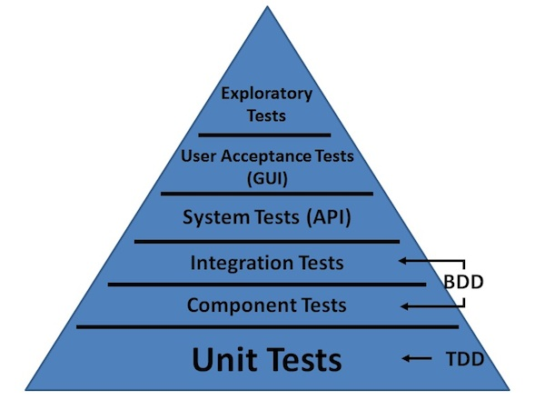
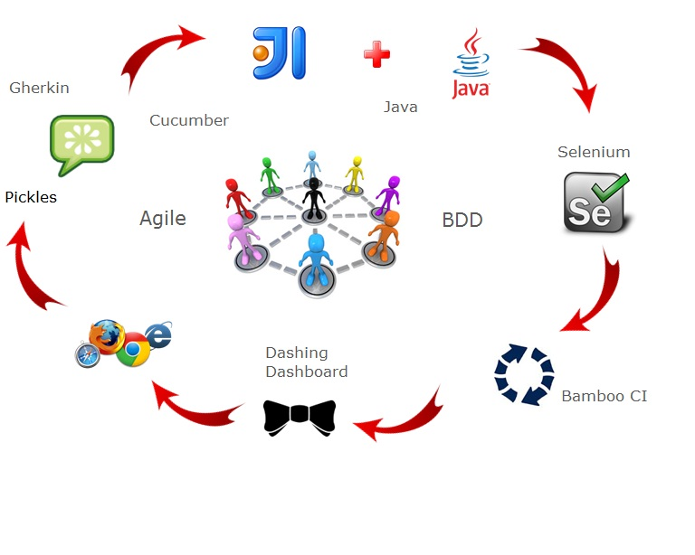
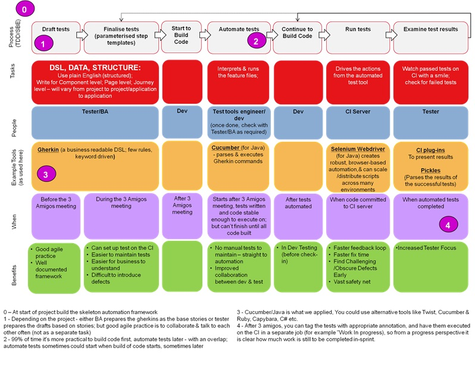
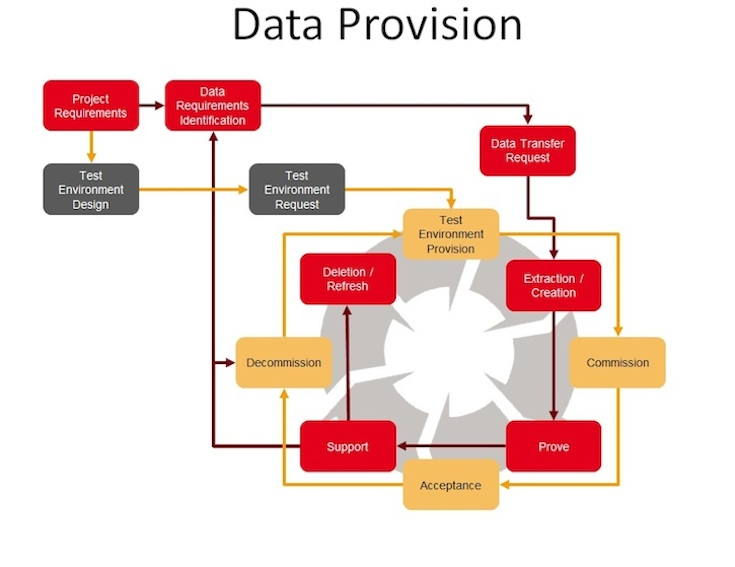
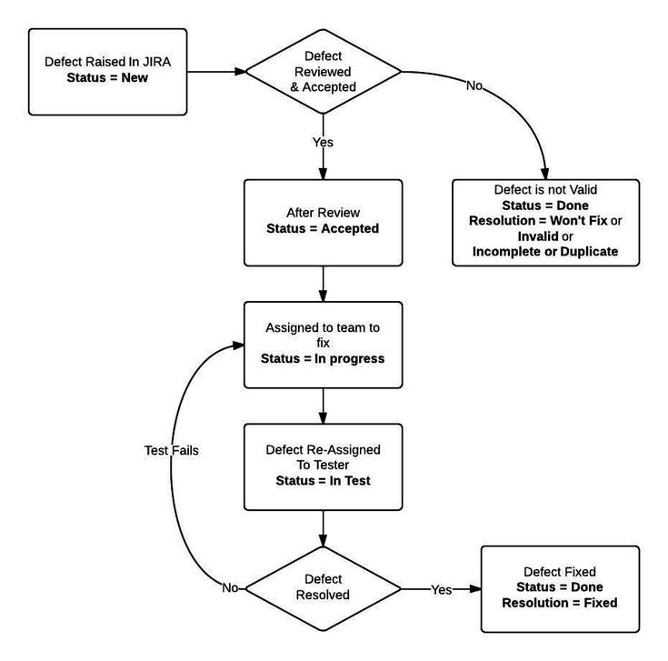

# TEST STRATEGY

<!--TOC max3-->

## Purpose
This test strategy describes the principles, approach, standards, practices, tools and techniques that are to be used for all the testing activities for either agile or waterfall projects, by the Online Services and Strategy division.
The information within this strategy will be used to create the required test artefact using the templates documented in the **References section**.

## Introduction
Software Testing is the process of evaluating an attribute or capability of a component or system and determining that it meets its required results.  Usually, quality is constrained to such topics as correctness and completeness, but can also include more technical requirements as described in the system quality attributes. Please refer to the **References section** for the location of these attributes. Testing is a process of technical investigation, performed on behalf of stakeholders, that is intended to reveal quality-related information about the product with respect to the context in which it is intended to operate. This includes, but is not limited to, the process of executing a component or system with the intent of finding defects. Quality is not an absolute; it is value to some person.

## The Testing Process

### Test Planning
Test planning is the activity of creating or updating the test plan. The test plan is a document describing the principles, approach, standards, practices, tools and techniques. It identifies amongst others; test items, the testing tasks, who will do each task, degree of tester independence, the test environment, the test design techniques and entry and exit criteria to be used, and the rationale for their choice, and any risks requiring contingency planning.

### Test Design
Test design is the activity of creating test cases and test steps to test specific test items as documented within the test plan. Test cases will be designed using what has been defined within the **Test Design section**. This requires knowledge of the software and functionality to be tested. Tests can be designed and ordered based on specific projected needs such as risk or time for example. These tests will cover automated and manual testing where applicable.

### Test Execution
Test execution is the process of running a test on the component or system under test conditions, producing actual result(s).
The execution can be automated with the use of software, e.g. capture/playback tools, to control the execution of tests, to compare actual results to expected results, to setup test preconditions, and other test control and reporting functions.
The test concept and test technique to be used will be defined in the test plan and will describe the method used to perform the actual test execution, either manual or automated and if any test execution tools will be used or considered.

### Test Analysis
Test analysis is the process of analysing actual test results against the expected test results, using the specified test style which is described below. These results will be captured using what has been defined within the **Test Reporting section**.

### Test Closure
Test closure is the process when testing of a specific project is completed. The test completion report documents how the testing was performed, the results from the testing against previously agreed coverage and any other test execution issues such as deviations from the plan, risks and issues or outstanding issues to be addressed.

## Test Concepts
The following test concepts will be used to update the test approach section in the test plan and they are described below.

### Test Subject
The following test subjects will be used within the test approach section of the test plan.

- source code
- binaries
    - class / method
    - component / package / module
    - application
- system
- documentation
- manifests for automated provisioning
- configuration
- migrated data

### Test Style
The following test styles will be used within the test approach section of the test plan.

- Execution
    - Pass/fail
    - Measure
- Inspection
    - Expert review

### Test Objective
The test objectives that can be used across both functional and non functional testing are described below and cover the types of testing that are applicable to both agile and waterfall testing. Refer to the **Test Techniques section** to ascertain which test objective are applicable to which test technique.

- Detect defects - This test objective will execute tests to find defects
- Detect regression - This test objective will execute tests that will find functionality that has regressed
- Validate (building the right thing) - This test objective will execute tests that will ensure that the functionality is what the user wants
- Verification (building the thing right) - This test objective will execute tests that will ensure that the functionality meets the requirements
- Acceptance - This test objective will execute tests to ensure that processes are completed as expected and designed and also that they meet the user acceptance criteria
- Smoke - This test objective will execute a small set of tests to ascertain that the most crucial functionality works as expected - this is usually used for a first time deployment in a given test environment
- Baseline - The test objective will ascertain the end-to-end response times for a single or small set of users.  This measure indicates the best response a system can deliver without any background load. This test is usually configured to run each script in turn for either 20 minutes or 10 iterations so that significant mean average transaction and page times can be calculated.
- Stress - This test objective will execute tests that will test the maximum transactional volume that an application or system will support. Business processes are put under load with a linear ramp up starting at peak load. This ramp up will continue until performance restriction is seen, the network is saturated or load injector resource is maximised.
- Load - This test objective will execute tests that will run for a sustained period of time, typically 1 hour, at anticipated normal or peak transaction volumes will all tests running simultaneously to create a benchmark of system performance performance and also to determine what load can be handled by the application or system
- Soak - This test objective tests the application or infrastructure ability to support normal load volumes over a period of time equivalent to abnormal day (e.g. 6-8 hours). Usually executed during the night, this test objective can highlight issues such as memory leaks, log overflows and queue saturation.
- Confirmation  - This test objective will retest a test that has previously failed, to ensure that the fix has worked (i.e. confirm that a defect has been fixed)

### Test Author
The following test authors will plan and identify the test cases for the relevant test technique (see **Test Techniques section**) and they will also create the tests steps for the test cases for either manual or automated tests.

- Engineers - Senior software engineer, lead front end developer
- Test engineer
- Penetration tester (specialist tester for Security testing)
- User
- Infrastructure engineer

### Test Executor
The following test executors will execute the tests for the relevant test technique (see **Test Techniques section**) and they will also ensure that test evidence is captured as well as raising defects (see **Defect Management section**).

- Engineers - Senior software engineer, lead front end developer
- Test engineer
- Penetration tester (specialist tester for Security testing)
- User
- Release manager
- Infrastructure engineer

### Reproducibility
Reproducibility is where a failed test outcome can be reproduced, by a different test executor, on a different environment, thereby confirming that the issue is code related and not caused by the infrastructure.

### Independence
To ensure test independence it is important that test cases are written with no dependency or linkage into any other test, thereby allowing them to be run in isolation, or in parallel. Also if the test fails it will not stop other tests from being executed.

### Prioritisation
Prioritisation of tests is important as this will ensure that quality risks are discovered early, which allows them to be fixed which will help to ensure that the required test coverage is achievable within the relevant timescales of the test sprint or test cycle. This will also allow for the highlighting of hot spots within the test sprint or test cycle.
The following techniques are applicable for prioritisation of tests.

#### Risk Based Approach
Two test techniques that can be used to ascertain the priorities are the MSCW approach and heatmaps. The recommended approach is the MSCW approach as this is more widely used and a proven technique and requires no training, whereas heatmaps is a newer approach, requires a tool and may require training before it can be used.  

- MoSCoW - a method to prioritise the requirements by Must, Should, Could and Would
	- Must - these are must haves, they are non-negotiable
	- Should - these are high priority and should be included if possible
	- Could - these are desirable, but not necessary and could be included if no affect on anything else
	- Would - these will not be included in current release, but may be considered for the future

- Heatmaps - an approach to provide visual representation - using both business and technical risks - to ensure these are fully and properly assessed against a view of the systems architecture.  

#### Other approaches
Other approaches to test prioritisation are as follows and closely follow the techniques highlighted under the **Test Design section**.

- Statement coverage - tests are prioritised by number of statements covered
- Branch coverage - tests are prioritised by number of branches covered
- Exploratory testing - this is classed as a experience-based technique and is designed to find defects that other more function related techniques may miss
- Checklists - this can be classed as another experience-based technique and will define what to test, how much and in what order.

### Traceability
Traceability is an output that will demonstrate completeness of testing against documented requirements or user stories as well as monitoring test progress for completeness. This will be achieved by using the following measures.
The test management tool will allow the linkage of tests against requirements or user stories and will also allow for the tracking of test execution progress and linked defects.

- …of tests to requirements/stories.
- …of test execution failures to application defects in our task tracker.

Manual test cases for each requirement or user story will be documented using the test management tools. For these tests the linkage between the requirements/user story and the tests used to verify these stories will be clearly visible using standard features in the test management tools. Any requirement or user story can be viewed, and the tests associated with that requirement easily identified

Automated test cases will have a reference to user stories through a unique ID therefore providing traceability from automated tests to user stories.

## Test Techniques
The test techniques that can be included within the test plan, are described below and can be used by both agile and waterfall respectively:-

### Requirements Testing - waterfall

| | |
|---          | ---
| Subject     | Documentation
| Style       | Pass / fail
| Objective   | Detect defects, validate
| Author      | N/A
| Executor    | Test engineer
| Automated   | No
| Environment | No

This test technique is used to verify the functional and non-functional requirements and this is completed using a defined ruleset which will provide a mechanism to ensure that the requirements accurately describe what is needed. Each ruleset is assigned a %target and each requirement is reviewed against all ten rulesets and they either pass or fail. The total %pass rate is compared to the %target - which will determine which rulesets have passed or failed - see below for the ten rulesets.

Please refer to the **References section** at the end of this document for the location of the Test Requirements Checklist document and definitions of the rulesets.

This should happen prior to development starting, therefore reducing costs of defects if found at this stage.

Rulesets:

- Complete
- Unambiguous
- Singular
- Achievement Driven
- Measurable
- Developable
- Business Owned
- Security
- Performance
- Testable

### Requirements Testing - agile

| | |
|---          | ---
| Subject     | Documentation
| Style       | Pass / fail
| Objective   | Detect defects, validate
| Author      | N/A
| Executor    | Test engineer
| Automated   | No
| Environment | No

It is recommended that the following checklist is adopted as a reference when reviewing agile requirements at any level. It is common to have the full checklist printed and put on the team meeting room wall for use during backlog grooming and user story acceptance criteria discussions.

#### INVEST
This test technique is used to verify that the user story is of required quality and incorporates some elements of the 10 point checklist above.

|LETTER		|MEANING		|DESCRIPTION
|-			|-				|-
|I			|Independent	|The user story should be self-contained, in a way that there is no inherent dependency on another user story. This should include checking that it is complete, unambiguous and singular.
|N			|Negotiable		|The user story, up until they are part of an iteration/sprint, can always be changed or written.
|V			|Valuable		|The user story must deliver value to the end user.
|E			|Estimatable	|The user story must be able to be estimated or sized, and should be measurable (e.g. clarity around measurable ranges, and no ‘woolly’ statements).
|S			|Small			|The User story should not be so big as to become impossible to plan/task/prioritise with a certain level of certainty.
|T			|Testable		|The user story must provide the necessary information to make test development possible.

Care should be taken to ensure that non-functional as well as functional requirements are included in user stories, and assessed against this checklist in the same way.

### Unit Testing

| | |
|---          | ---
| Subject     | Class / method, component / package / module, application
| Style       | Pass / fail, measure
| Objective   | Verification, detect regression
| Author      | Engineers
| Executor    | Engineers
| Automated   | Always
| Environment Type| Development

This test technique is used to demonstrate / confirm that the individual components (a minimal software item) work as specified / documented.

### Continuous Integration

| | |
|---          | ---
| Subject     | Configuration, class / method, component / package / module, application
| Style       | Pass / fail, measure
| Objective   | Verification, defect regression
| Author      | Engineers
| Executor    | Engineers, release manager
| Automated   | Always
| Environment Type | All

This test technique is facilitated by the use of a CI Tool and will be used by the Engineers. This will encompass the build and test process and will allow for reporting on the success and failure of your build and test runs.

Please refer to the **References section** at the end of this document for the location of the Release Strategy, for more information.

### System Testing

| | |
|---          | ---
| Subject     | System
| Style       | Pass / fail
| Objective   | Detect defects, confirmation, verification
| Author      | Test engineer, infrastructure engineer
| Executor    | Test engineer, infrastructure engineer
| Automated   | Sometimes
| Environment Type| Test

This test technique is used to demonstrate / confirm that a set of components and/or interfaces (a link between either components or systems), work with other components and/or interfaces as specified / documented.

### Integration Testing

| | |
|---          | ---
| Subject     | System, configuration
| Style       | Pass / fail
| Objective   | Detect defects, confirmation, verification
| Author      | Test engineer, infrastructure engineer
| Executor    | Test engineer, infrastructure engineer
| Automated   | Nearly always
| Environment Type| Test, Production

This test technique is used to demonstrate / confirm that the systems and/or interfaces operate as intended, including the flow and exchange of data, from start to finish, as specified / documented.

### Regression Testing

| | |
|---          | ---
| Subject     | System, configuration, class / method, component / package / module, application
| Style       | Pass / fail, measure
| Objective   | Verification, detect regression
| Author      | Test engineer, infrastructure engineer, engineers
| Executor    | Test engineer, infrastructure engineer, engineers
| Automated   | Nearly always
| Environment Type | Test, Development

This test technique is used to demonstrate / confirm that changes to the system have not broken existing functionality that has previously been tested and passed, or functionality that is unchanged. The tests for this technique are often referred to as the regression test pack.

#### Regression Test Pack
Test cases are grouped into a regression pack, based on happy paths, must tests and a selection of could tests and tests from test items that have had a number of defects found. The regression pack will evolve during the life cycle of the project and where possible, should be linked in with the build process and should be run each time a build is deployed.

### Operational Acceptance Testing

| | |
|---          | ---
| Subject     | System, application
| Style       | Pass / fail, measure
| Objective   | Validate, stress, load, soak
| Author      | Test engineer, infrastructure engineer, engineers, penetration tester
| Executor    | Test engineer, infrastructure engineer, engineers
| Automated   | Sometimes
| Environment Type | Production

This test technique is used to demonstrate / confirm that the system integrates as required within the system architecture, as well as demonstrating / confirming that the non-business aspects of the system function correctly.

The system quality attributes will be used to ascertain the test cases - please refer to the **References section** at the end of this document for the location of the System Quality Attribute documents.

N.B. The Security document includes several methodologies and so the relevant test plan will document which ones are applicable for which project.

### User Acceptance Testing

| | |
|---          | ---
| Subject     | System
| Style       | Expert review, pass / fail
| Objective   | Validate, acceptance
| Author      | User
| Executor    | User
| Automated   | Sometimes
| Environment Type | Test, Production

This test technique is used to demonstrate / confirm that the changed system is to the satisfaction of the end user or customer.

### Data Migration Testing

| | |
|---          | ---
| Subject     | Migrated data
| Style       | Pass / fail
| Objective   | Detect defects, confirmation, verification
| Author      | Test engineer
| Executor    | Test engineer
| Automated   | Sometimes
| Environment Type | Test

The objective of this technique is to ensure migration of data from one environment to another, without causing any impact on the functionality of the application which runs on this data.

### Test Driven Development

| | |
|---          | ---
| Subject     | Class / method, component / package / module, application
| Style       | Pass / fail, measure
| Objective   | Verification, detect regression
| Author      | Engineers
| Executor    | Engineers
| Automated   | Nearly always
| Environment Type | Development

Test Driven Development (TDD) is a software development process which predicates on the writing of automated software test cases that define a desired state (via a class, function or method) then produces the minimum via amount of code to pass a test. The use of TDD encourages atomic design and increases confidence in the solidity of the code.
TDD is considered to be the most prudent route to achieving a high degree of quality in the software that is produced.

For effective TDD, we consider the following:-

- Keep the unit small and the suite consistent
- Restore the system or application to it’s state pre-test
- Avoid dependencies and inheritance between test cases (de-couple state)
- Do not have test cases relying on state from previous executed test cases

#### Benefits

- Improved developer productivity
- Validation of correctness in code
- Can lead to more modularised, extensible and maintainable code
- Reduces coupling between components
- Validates (software) design from first test

### Behaviour Driven Development

| | |
|---          | ---
| Subject     | Class / method, component / package / module, application
| Style       | Pass / fail, measure
| Objective   | Verification, detect regression
| Author      | Engineers
| Executor    | Engineers
| Automated   | Nearly always
| Environment Type | Development

Behavioural Driven Development (BDD) is a software development process that aims to combine the techniques from TDD with domain driven design (DDD) and object oriented analysis and design (OOAD). Succinctly, BDD looks to place software development as a core function of both the business interest and technical focus. For effective implementation, the BDD process should follow:

- Define  test set for the unit first
- Implement the unit
- Verify that the implementation of the unit makes the test succeed
- Usage of a domain specific language

#### Benefits

- Offers precise guidance on the communication between developers, test engineers and domain experts
- The notations used are closely aligned with the business needs
- Automatic technical documentation can be generated from the BDD specifications

### Acceptance Test Driven Development

| | |
|---          | ---
| Subject     | Class / method, component / package / module, application
| Style       | Pass / fail, measure
| Objective   | Verification, detect regression
| Author      | Engineers
| Executor    | Engineers
| Automated   | Nearly always
| Environment Type | Development

Acceptance Test Driven Development (ATDD) uses many of the same techniques as both TDD and BDD. When using ATDD there is an emphasis on communication and collaboration throughout the team especially between the engineers and business analysts/product owners. The test format is generally in the Given (context), When (Event), Then (Outcome) format.

### Static code analysis

| | |
|---          | ---
| Subject     | Source code
| Style       | Expert Review
| Objective   | Verification, detect defects
| Author      | Engineers
| Executor    | Engineers
| Automated   | No
| Environment Type | Development

Static Code Analysis is performed as part of a white box testing at the code review stage. It is usually carried out at the Implementation phase of a Security Development Lifecycle (SDL). Static Code Analysis commonly refers to the running of Static Code Analysis tools that attempt to highlight possible vulnerabilities within 'static' source code.

### Exploratory Testing

| | |
|---          | ---
| Subject     | System
| Style       | Expert review, pass / fail
| Objective   | Detect defects, validate
| Author      | Test engineer, penetration tester
| Executor    | Test engineer, penetration tester
| Automated   | No
| Environment Type | Test

This test technique is a manual process that can be done in conjunction with test automation. The test engineer will use their experience, skills and knowledge of the system to simultaneously design and execute tests. This technique is aimed to discover defects and by gaining better knowledge of the system, could lead to the creation of additional automated tests.

A simple explanation of exploratory testing is simultaneous learning, test design and test execution. Thus the test engineer controls the design of the tests and as they are executed, can use the information gained to design new tests or even better tests.

### Test Doubles

| | |
|---          | ---
| Subject     | System, configuration, class / method, component / package / module, application
| Style       | Pass / fail
| Objective   | Verification, detect defects
| Author      | Engineers, test engineer
| Executor    | Engineers, test engineer
| Automated   | Always
| Environment Type | Development, Test

Test doubles is an important part of automated testing and enables test independence. By using test doubles it allows for objects to be replaced for testing purposes so that these can be tested in isolation. This means that parts of the application or system can be tightly constrained so that its behaviour can be determined more easily.

A test double is a generic term for any case where you replace a production object for testing purposes.

- Dummy Objects - Passed around but never actually used. Usually they are just used to fill parameter lists
- Fake Objects - Have working implementations, but usually take shortcuts which makes them not suitable for production
- Stubs - Provide answers to calls made during the test, usually not responding at all to anything outside what's programmed in for the test
- Spies - Record information based on how they were called
- Mocks - Pre-programmed with expectations which form a specification of the calls they are expected to receive. They can throw an exception if they receive a call they don't expect and are checked during verification to ensure they got all the calls they were expecting.
- Harness - Setup when you don't have a test instance of a particular external system

### Techniques Pyramid

## Test Automation
The approach to testing on agile projects is to test early and often, making use of techniques such as Test Driven Development (TDD) and Behaviour Driven Development (BDD), test automation and continuous integration. This ensures a business solution focus from the outset, prevention of defects, a consistent and repeatable suite of tests, and a way of providing continuous confidence in the builds produced.

The recommended approach to test automation is to build a tailored automated framework:

- that allows creation of a test in a single script
- that script is written using a Domain Specific Language
- the script is interpreted by the Framework (using code)
- the test is then executed via an execution engine (tool) – this can be done for unit testing, system testing and end to end testing

The diagram below is an example of the toolset that may be used:

When implemented successfully, this de-skills the automation effort, allowing the test engineers to spend more time for example, finding defects (using techniques like exploratory testing) rather than rechecking that the software system still does what it is supposed to do.

Automation frameworks are particularly important for agile projects where releases are iterative and code is continually being developed and tested. Large-scale manual regression testing is not a viable option as the nature of agile means that the testing activity has to be planned, prepared and executed within specified sprints; a test automation framework supported by continuous integration means that any time there is a change to the code, a full suite of regression tests is run immediately and automatically.

The diagram below illustrates the key activities, roles, timings and benefits of the recommended agile automation approach, based on BDD. What is important is the framework and the process itself – the tools are simply there to assist.

Where possible, and where there is high repeatability of tests, we will automate tests using the framework approach.  But sometimes, if the project have highly visual and graphical elements within the solution, some areas will not be automated, and will be tested using a combination of manual tests, and exploratory tests.   

Unit and integration testing with continuous integration is recommended in all agile application developments to ensure high quality deliveries and optimise the development timeline. For further information please refer to the **References section** at the end of this document for the location of the Architecture and Development Strategy.

Rather than leave all of the performance testing  until late in the delivery of the overall solution, it is recommended that micro-performance testing be carried out at intervals throughout a project.  Ideally this would begin as soon as there is enough functionality to run some meaningful tests with load, with additional scripting, execution and analysis work being done during agreed later sprints.

Test automation needs to be considered for waterfall projects as well as agile projects.

## Test Design

### Test Cases		
Test cases can be derived for both agile and waterfall using the following techniques:-

- Test cases from a requirement specification or user story
	-	Boundary Value Analysis (BVA) - Used to test the values that exist on the boundaries of ordered equivalence partitions.
	-	Equivalence Partitioning (EP) - Used to reduce the number of test cases that are required to efficiently test the handling of inputs, outputs, internal values and time related values.
	-	Use Case - This will include the interaction a user has with the system in order to achieve a specific task.

- Test cases from the structure of a component or system
	-	Statement coverage - The percentage of executable statements that have been exercised by a set of test cases.
	-	Branch coverage - The percentage of executable branches that have been exercised by a set of test cases.
	-	Path coverage - The percentage of paths that have been exercised by a set of test cases. 100% path coverage implies 100% LCSAJ coverage.

	-	LCSAJ (linear code sequence and jump) - The percentage of LCSAJs of a component that have been exercised by a set of test cases.

- Test cases based on test engineers experience
	-	Error guessing - uses experience to guess potential errors.
	-	Exploratory testing - Previously described under test techniques.
	-	Checklists - Uses a high level list of items to be either noted, checked, remembered - these can be defined using a set of standards or based on experience.

### Manual Test Cases
Test cases for manual testing will be created within the test management tools and will be updated with the following information and for traceability will be linked to either a requirement or user story:-

- Test Case ID
- Test Case Description
- Test Case Purpose of Test
- Test Case Test Data
- Test Case Expected Results
- Test Case Test Steps

### Automated Test Cases
Test cases for automated testing will be created within the required testing tool (please refer to the **Test Execution Tool(s) section**) and for traceability the user story or requirement will be linked to the automated test case.

### Happy and Sad Paths
This test design is used to determine the test steps that will be executed, using known inputs and will produce an expected output. The happy path testing consists of the path through a system where everything works as expected and the system stays up. The sad path testing is to verify that the system handles errors as expected but still stays up (e.g. reacts in a manner as defined by the security design).

## Test Environments
Having appropriate test environments and data is a key part of enabling this test strategy.  Test environments will be required to be setup to test each test technique and versions of hardware and software will depend on the test technique and specific project. Depending on the specific project, there may be many occurrences of each test environment type.

Each of the specific **named test environments** need to be documented in the specific test plan, and the details on who is responsible for creating, supporting, refreshing and decommissioning these, will be included within the equivalent Infrastructure or Development plan.

For information the following **test environment types** are referenced in this document:

- Development
- Test
- Production

## Test Data
Test data requirements for testing projects will be defined in the test plan, and consideration should be given to the following:

- How the test environment(s) will be populated with test data, particularly if this will use conversion procedures
- Dependencies on third parties for provision of test data
- Simulated live data, anonymised live data or true live data
- Data regression and ageing
- The approach to meeting requirements for high volumes of data (addition, generation or simulation)
- Any tools required to support the gathering and amendment of test data
- The general approach to the creation of test data
- How the content and source of the data will comply with the Scottish Government best practices regarding data protection
- If a core baseline set of test data is maintained for the applications under test, lead times for uploading this should be considered
- Test data needs to be managed carefully so that the correct amount of data is setup to ensure performance optimisation for the relevant test technique
- Isolation of test data will be required to manage expected results
- Rollback and restore of test data may be required for certain tests
- Test doubles can be used with test data setup to simulate dependencies
- Creation of a customised dataset based on a subset of production data
- Provide an in-memory relational database, i.e. fake a database
- Minimise the dependance on tests of large complex data structures
- Test reference data (different to test specific data)
- Application reference data using the application’s API

The test data provisioning, on-going management and maintenance will be the responsibility of the technical team.

As part of the test preparation activities on a project, test data will be required to be specified for all levels of testing, with the following categories typically being required:

- Static data
- Existing or historic data
- Migrated and converted data
- Test or manual data

For each level of testing there will be different application areas that will be required to provide data for testing, including third party systems and services. The specific data requirements for each level will be described in the test plan, and refined during the planning stage.

The following sections provide further guidance on the test data types listed above.

### Static Data
There is often a requirement to populate test databases with essential static/reference data for each of the systems to support the functionality.
The technical team will ensure that the relevant static/reference data is delivered by the appropriate team, extracted from production or created as part of the environment build, ensuring the data is available prior to test execution.

### Existing/Historic Data
Where existing/historic test data is required, the recommendation will be to use a masked/de-sensitised copy of production data (within the relevant test environment), ensuring and Personally Identifiable Information (PII) is anonymised to maintain compliance DPA and EU Data Protection legislation.  Where it is not possible to use Production data, or where there are specific data sets required that may not be provided by the production data (e.g. in a brand new system, there will be no production data until after the first release), it may be that automated tools can be used to generate test data to meet specific test case requirements.

### Migrated and Converted Data
Where migrated or converted data is required, the technical team will be responsible for producing this: this may be achieved by taking a copy of already migrated data and making it available to the test team after masking/de-sensitising; or if the test team are to test the migration as part of their tests, the technical team may provide a copy of non-migrated data, ready to carry out conversion on.   

### Manually Created Data
Where there is a requirement to create manual or dummy test records, the relevant team will be required to develop the data for their own testing or liaise with the relevant project team to supply the data.

The requirement for setup, update, backup, rollback and restore of the test data will be documented within the test plan.

## Test Reporting
Test reporting will be regularly provided to key stakeholders and will be based on a snapshot of the test dashboard at any given time.
N.B. Security test results will be restricted on a need to know basis.  

### Test Dashboard
The test dashboard will be setup and may contain the following. Please refer to the specific test plan for the actual test report requirements and metrics to be included.

| | |
|---          | ---
| Test Execution Progress          | To provide key stakeholders with test execution progress against the plan;
| Defects by Status                | To provide key stakeholders with a summary of open and closed defects;
| List of excluded tests           | To provide key stakeholders with a list of excluded tests based on the approved test coverage;
| Defects by Severity              | To provide key stakeholders with a summary of all open defects and their severity;
| Defects by Age	           | To provide key stakeholders with a summary of all open defects and their age;

### RAG Status Definitions

| STATUS | DEFINITION | ACTION
| ---    | ---        | ---
| RED    | There is a blocker with testing that will impact the test coverage against the test plan. | Need to investigate what the blocker is and revisit the test coverage.
| AMBER  | There is a potential risk with testing that could impact test coverage against the test plan. | Action is being taken to resolve this and prevent the issue becoming a blocker.
| GREEN  | The testing is on target to meet agreed coverage based on the test plan. | None.

### Test Metrics
The following test metrics may be included within the test reporting of the test execution progress and defects by status section of the dashboard. These test metrics can apply to all applicable test techniques and will demonstrate traceability, which is described in the **Traceability section**.

- Number and % tests not yet run
- Number and % tests passed
- Number and % tests failed
- Number and % tests in progress
- Number and % tests blocked (tests not run but blocked by a current defect)
- Number and % defects found, by severity
- Number and % defects fixed, by severity
- Number of defects outstanding by age
- Number of defects outstanding by severity

## Artefacts
The following is a list of all test artefacts that are required for either agile or waterfall projects.

### Test Artefacts

| Artefact               | Review Frequency | Author        | Approver                                                 | Phase                                | Description |
| ---                    | ---              | ---           | ---                                                      | ---                                  | ---         |
| Test Plan              | Quarterly        | Test Engineer | Test Manager, Project Manager, Product Owner, Governance | Test Planning                        | A document to describe a test approach for a specific project           |
| Test Cases             | Monthly          | Test Engineer | Test Manager, Product Owner, Governance                  | Test Design                          | A set of steps to demonstrate test coverage as per test approach         |     
| Test Readiness Review checklist | Never            | Test Manager  | Governance                                               | Test Execution                       | A meeting with a checklist to ensure testing can commence          |
| Test Reporting         | Weekly           | Test Manager  | N/A                                                      | Test Analysis                        | A report dashboard to show test progress       |
| Third Party Test Report | Never           | Third Party Testing Team  | Test Engineer, Test Manager, Technical Architect  | Test Analysis                        | A document to describe the test outcome from a third party supplier   |
| Test Completion Report | Never            | Test Manager  | Project Manager, Product Owner, Governance               | Test Closure                         | A document to describe test outcome for a specific project         |

### Test Schedule - waterfall only
The test schedule will describe the testing activities to be undertaken within a test cycle - including sequencing and dependencies, where relevant. This will be used by waterfall only, as the sprint planning under agile is the equivalent.
This will be maintained within the test management tools.

#### Test Cycles
Test cycles are used to group certain test cases based on their priorities, the deployment build plan of new or amended functionality or defect fixes. During the planning of the test schedule it may be a requirement to repeat a test cycle. A typical plan is usually of 3 cycles of functionality with regression - with the last cycle running clean.

### Test Readiness Review checklist - waterfall only
The test readiness review checklist will assess whether the project is ready for testing to commence. This will be used by waterfall only, as the daily scrum meeting under agile is the equivalent.
Please refer to the **References section** at the end of this document for the location of the Test Readiness Review checklist Template.

## Quality Gates

### Agile testing - Definition of Done
The definition of done is how we define acceptance criteria in agile projects – it is the quality gate from testing into production.  

- DN1 - Each user story is fully developed, tested and accepted by the product owner (i.e. acceptance criteria for each story is met – see note below)
- DN2 - Agreed test coverage, including test types, levels or techniques, completed and achieved for each user story
- DN3 – There are no outstanding defects for each user story (If there were any they would have been added to the product backlog)
- DN4 - Any excluded tests have been agreed and added to the product backlog
- DN5 – The User story is able to be released into Live

The codes for each condition are used to cross reference the test plan against the test completion report.

### Agile testing - User Story Acceptance Criteria
Acceptance criteria define the boundaries of a user story, and are used to confirm when a story is completed and working as intended.  The acceptance criteria are written in simple language, just like the user story. When the development team has finished working on the user story they demonstrate the functionality, showing how each criterion is satisfied.  They are things that must or must not happen.

Good acceptance criteria:

- Should state an intent not a solution (e.g. “The user can choose an account” rather than “The user can select the account from a drop-down”)
- Are independent of implementation (ideally the phrasing would be the same regardless whether this feature/story would be implemented on e.g. web, mobile or a voice activated system)
- Are relatively high level (not every detail needs to be in writing)
- Are definitive i.e. ‘the user will be able to do this’
- Are provable
- Are absolute
- Can be tested using negative testing

### Waterfall testing - Quality Gates  			 	
The quality gates, which define a set of conditions that must be met to move from one test technique to another are described below. Any deviation from this when producing a test plan must be agreed at Programme / Project Board level.

#### Exit Criteria - Unit testing
- EX1 - Agreed test coverage completed and achieved, e.g. 80% of tests
- EX2 - No outstanding Blocker or Major Defects - refer to section on Defect Management for defect severity definitions
- EX3 - Outstanding Minor or Trivial defects discussed and an agreed plan documented - refer to section on Defect Management for defect severity definitions

#### Entry Criteria - System testing
- EN1 - Test plan document discussed and agreed
- EN2 - Test cases created, discussed and agreed
- EN3 - Test schedule discussed and agreed
- EN4 - Test coverage discussed and agreed, e.g. 100% of priority tests and 80% of other tests
- EN5 - Test readiness review checklist discussed and agreed
- EN6 - Test resources identified and available
- EN7 - Test environment and data identified and available

#### Exit Criteria - System testing
- EX4 - Agreed test coverage completed and achieved, e.g. 100% of priority tests and 80% of other test
- EX5 - No outstanding Blocker or Major Defects - refer to section on Defect Management for defect severity definitions
- EX6 - Outstanding Minor or Trivial defects discussed and an agreed plan documented - refer to section on Defect Management for defect severity definitions
- EX7 - Test completion report document discussed and agreed

#### Entry Criteria - Integration testing
- EN8 - Test plan document discussed and agreed
- EN9 - Test cases created, discussed and agreed
- EN10 - Test schedule discussed and agreed
- EN11 - Test coverage discussed and agreed, e.g. 100% of priority tests and 80% of other tests
- EN12 - Test readiness review checklist discussed and agreed
- EN13 - Test resources identified and available
- EN14 - Test environment and data identified and available

#### Exit Criteria - Integration testing
- EX8 - Agreed test coverage completed and achieved, e.g. 100% of priority tests and 80% of other test
- EX9 - No outstanding Blocker or Major Defects - refer to section on Defect Management for defect severity definitions
- EX10 - Outstanding Minor or Trivial defects discussed and an agreed plan documented - refer to section on Defect Management for defect severity definition
- EX11 - Test completion report document discussed and agreed

## Roles and Responsibilities
The following roles and responsibilities will be required for the Online Services and Strategy division, for all the testing activities described within this Test Strategy and the Test Plans.

### Test Manager
- Prepare Test Report - Dashboard
- Create Test Completion Report
- Manage Test Engineers
- Overall responsibility for all Testing activities
- Provide Testing guidance and coaching to test engineers
- Escalate Test Risks and Issues
- Participate in Release meetings				
- Participate in some of the meetings under the Agile process
- Setup Defect triage calls, where necessary

### Test Engineer
- Create Test Plan for either/or/and System Testing, Integration Testing, User Acceptance Testing and Regression Testing
- Create Test Cases - manual and automated
- Define Requirement/User Story/Feature traceability
- Identify / Specify Test Data and Test Environment requirements
- Participate in all meetings under the Agile process
- Perform Test Execution, capture test evidence and raise defects for System Testing, Integration Testing, User Acceptance Testing and Regression Testing
- Create test execution reports/graphs for the Dashboard
- Manage defects
- Create defect reports/graphs for the Dashboard
- Participate in Release meetings

### Test Coordinator (waterfall only)
- Create Third Party Test Completion Report
- Manage Third Party test engineers
- Overall responsibility for all Third Party Testing activities
- Escalate Test Risks and Issues
- Participate in al types of Test meetings				

### Product Owner (waterfall only)
- Review and approve internal Test Cases - manual and automated
- Witness Third Party testing, including test results, e.g. via a demo
- Perform Test Execution, capture test evidence and raise defects for User Acceptance Testing

### Technical Architect (waterfall only)
- Witness Third Party testing, including test results, e.g. via a demo

## Testing Tools

### Test Management Tool
The test management tool will allow tests to be created and viewed in any project, linked to other issues (i.e. requirements, themes, epics, features, user stories, test items, defects), executed immediately or as part of a test cycle and detailed test metrics can be tracked via customised gadgets and used by the dashboard.

The test management tool enables the test team to:

- Create, view, edit and clone tests
- Link to features, tasks, requirements etc.
- Plan test execution cycles
- Execute tests
- File defects
- Track quality metrics
- Create custom dashboards

### Test Issue Reporting Tool
A tool for capturing screenshots, performing exploratory testing by creating test sessions (single/multiuser) and recording test observations, will be required.

Thus, allowing this tool for all stakeholders (product owners, developers, designers, testers) to improve the quality of the system by quickly raising detailed defects, allowing the developers to speed along the process of fixing the defect.

### Test Execution Tools
The test execution tools will be documented within the test plan, as each project will have specific requirements.

## Defect Management
The defect management process documented below defines how defects will be managed in both agile and waterfall and within in house or 3rd parties.

- Agile - Defects that are found within the current sprint will not be recorded (zero defect backlog). Only defects that are for stories out with the current sprint will be recorded. These will then be added to the backlog and prioritised by the product owner in collaboration with the team.

- Waterfall - All defects will be recorded.

### Defect
A defect is a flaw in a component or system that can cause the component or system to fail to perform its required function, e.g. an incorrect statement or data definition. A defect, if encountered during execution, may cause a failure of the component or system.

### Defect Status

| Status       | Description
| ---          | ---
| New          | New Defect, first logged and assigned to test engineer.
| Accepted     | Defect has been reviewed and accepted by team.
| In progress  | Defect is being worked on, assigned to a team member.
| In test      | Defect has been fixed and deployed and available for test.
| Done	       | Defect is closed with a defect resolution.

### Defect Resolution
When a defect is set to the status of done then a valid resolution must also be recorded.

| Resolution       | Description
| ---              | ---
| Fixed            | Defect is resolved and tested successfully.
| Won’t Fix        | Supplied steps produce described behaviour, and it is a defect, but no further action will be taken.
| Duplicate	       | Defect is a duplicate of another defect.
| Incomplete	   | Defect does not have enough information. Test engineer to update defect so the described behaviour can be checked.
| Invalid          | The supplied steps produce described behaviour but it is not a defect.
| Cannot reproduce | Supplied steps do not produce described behaviour.

### Defect Severity
Defect severity is the degree of impact that a defect has on the development or operation of a component or system.

| Severity | Description
| ---      | ---
| Blocker  | Testing cannot continue. Defect must be fixed.
| Major    | Testing can continue on part of the system. Defect must be fixed.
| Minor    | Testing can continue. Does not impact business ability to use the service. Possible workaround required.
| Trivial  | Cosmetic / Documentation.

### Defect Priority
Defect priority is the level of (business) importance assigned to a defect. Priority defines the order in which we should resolve a defect. This will only be applied to defects under a waterfall project as defects under an agile project will be prioritised within the backlog.

| Priority | Description | Turnaround
| ---      | ---         | ---      
| High     | Not acceptable to the business | Fix within 24 hours.
| Medium   | Some impact to business. Possible workaround required   | Fix required within 5 working days or next scheduled build.
| Low      | No impact to business. Nice to have.                    | Fix required within 10 working days or planned for future build.

- The turnaround time and the descriptions are to be used as a guideline only. Turnaround times are suggested and should be determined per project and documented in the test plan.

### Documenting a Defect
When documenting a defect the following details should be included:

- Description of the task being performed.
- The exact steps that were being performed when the defect was found.
- The expected results from the task being performed.
- The actual results from the task being performed.
- A description and/or screenshot of the defect encountered.
- Defect is linked to an appropriate test.

> **Principle**: The purpose of the information requested above is to allow a defect to be reproduced. If a defect cannot be reproduced, it is very hard to fix.

Further advice:

- Be specific. If you can do the same thing two different ways, state which one you used.
- Be verbose. Give more information rather than less. If you say too much, some of it can be ignored. If you say too little, it may be necessary to come back and ask more questions.
- Read what you wrote. Read the report back to yourself, and see if you think it's clear. If you have listed a sequence of actions which should produce the failure, try following them yourself, to see if you missed a step.
- Speak to the team. Before raising a defect check with the team to see if it is valid. Speak to the developer if you come across a complex defect as its much more useful to give them a  walkthrough of the defect.

### Defect Process Flow
The test management tool will be customised to have the following defect process flow.

#### Defect Flow Event Changes
The following table describes the defect process flow and who is responsible for changing the status.

| Event | Responsible for Status change | Status of defect | Comments
| ---   | ---                           | ---              | ---
| A defect is raised as per the documenting details section and assigned to Test Engineer | Test Engineer | New | *If the test engineer doesn’t think the description or attachment is clear they will speak with the person that raised the defect to improve description. Status at New.*
| After discussion within the team its decided the defect is not accepted | Test Engineer | Done | *When a defect is done a valid defect resolution must be recorded.*
| The team accepts the defect | Test Engineer | Accepted | *Defect will be updated to accepted if the team agree its valid.*
| The defect is assigned to the team to fix | Test Engineer | In Progress | *Defect will be assigned after discussion on prioritisation.*
| Defect fixed and assigned to Test Engineer | Team | In Test | *The defect has been corrected and the fix is available to retest (Code or documentation).*|
| Test Engineer confirms the defect is resolved | Test Engineer | Done | *When a defect is done a valid defect resolution must be recorded.*
| Defect is not resolved. Assigned back to the team | Test Engineer | In progress | *Test Engineer assigns the defect that has not been resolved back to the appropriate team member to fix.*

## References

| Document                                 | Location
| ---                                      | ---
| Test Plan Template                       | `/templates`
| Test Completion Report Template          | `/templates`
| Test Readiness Review Checklist Template | `/templates`
| Test Requirements Checklist              | `/templates`
| System Quality Attributes                | *TODO*
| Infrastructure Strategy                  | *TODO*
| Architecture and Development Strategy    | *TODO*
| Release Strategy                         | *TODO*
| Third Party Test Report              	   | `/templates`
