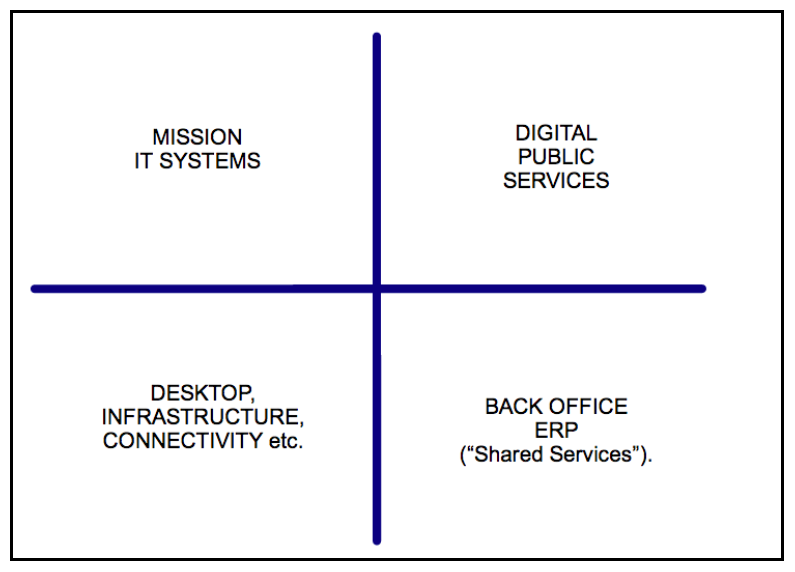

# Reference Model: GDS' Shape of Government Technology

## Purpose

An architecture reference model is an abstract framework or domain-specific ontology consisting of an interlinked set of clearly defined concepts produced by an expert or body of experts in order to encourage clear communication. This frame of reference can then be used to communicate ideas clearly among members of the architecture and/or delivery community.

The purpose of this model is to provide a classification of government technology into functional areas.

## Contents

<!--TOC max3-->

## Revision History

| Version | Issued     | Comments
| -       | -          | -
|     0.1 | 21-04-2016 | Extracted from the original blog post.

## Distribution List

| Role | RACI
| -    | -
| Head of Digital Architecture (HoDA) | Responsible

N.B. The HoDA is responsible for reviewing this document, all other responsibilities related to this reference model are with the publisher of the original blog post.

## Review

| -                  | -
| *Review frequency* | 6 months
| *Next review due*  | 21-10-2016

N.B. review of this model is restricted to considering that the blog post and, therefore, this model is still relevant.

## Role

 The purpose of this model is to provide a classification of government technology into functional areas. The discussion section explains GDS' strategy to address the delivery of technology in these functional areas, in support of their overall vision for public sector digital delivery.

 This reference model has been extracted from a GDS blog post on "[Rebalancing technology across government](https://gds.blog.gov.uk/2013/05/21/rebalancing-tech-across-gov/)".

## Scope

- [ ] Foundation
- [ ] Common Systems
- [x] Industry
- [ ] Org-specific

This reference model is specific to the public sector.

## Taxonomy

GDS have mapped government technology into four distinct functional areas:

1. **Digital public services**: the transactional services that drive citizen engagement with the state.
2. **Mission IT**: the line of business applications that run the individual internal processes of departments and agencies. These are often specific to their business functions and many can be defined as 'special', although they draw upon underlying commodity components.
3. **Infrastructure**: the common connectivity, hosting and device management services that enable organisations to have the tools they need in the hands of officials and colleagues.
4. **Back office**: the day to day services like HR and Finance that run the operations of all our departments and agencies.

## Graphic

## Discussion

From the original blog post in 2013:

> Some of these areas are things that meet common user needs across government. To address those, GDS will implement government as a platform, providing departments with common business functionality that can be re-used by multiple users in multiple service areas. For specific needs, such as those in Mission IT and digital public services, GDS and the Cabinet Office will work alongside departments to ensure they have the capability and support they need to meet them. The service manual is a big part of building that digital capability across government, and GDS plans to provide a similar level of support to technology services.

> Other organisations like eBay and Paypal have already successfully implemented the platform model, developing a core technology infrastructure that others have then built upon – driving the success of the platform and meeting users’ needs more effectively than the original provider could have achieved alone.

> These changes will be introduced over the next 5 years as deals for existing services come to their natural end. As these expire, departments and users will be transitioned to common services. The Cabinet Office will support departments in ensuring that it can be successfully delivered. The outcomes will be worth it: early adoption of this approach has already made significant savings.

> By focusing on our users’ needs, driving towards commodity services wherever possible, sharing services and breaking down departmental silos we will be able to make large savings for the taxpayer. But we will also be able to deliver technology that is fit for purpose and supports civil service reform.

## References

- [GDS on Rebalancing technology across government](https://gds.blog.gov.uk/2013/05/21/rebalancing-tech-across-gov/)
- [TOGAF standard, version 9.1, part VI](http://pubs.opengroup.org/architecture/togaf9-doc/arch/toc-pt6.html);
- [Wikipedia: Reference Models](https://en.wikipedia.org/wiki/Reference_model).

## Attribution

This document contains public sector information licensed under the Open Government Licence v3.0.
