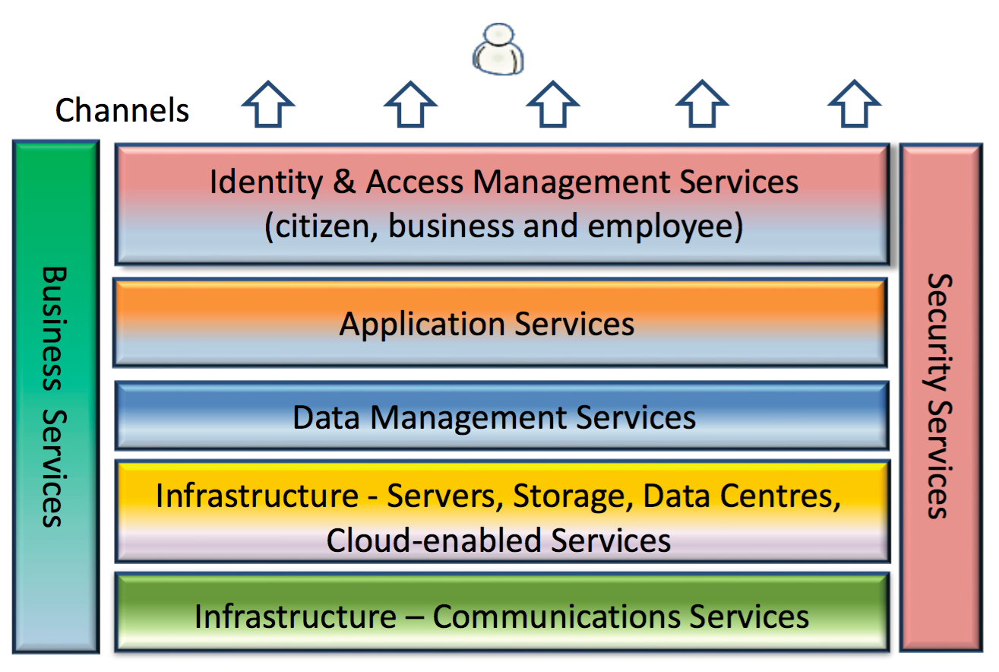
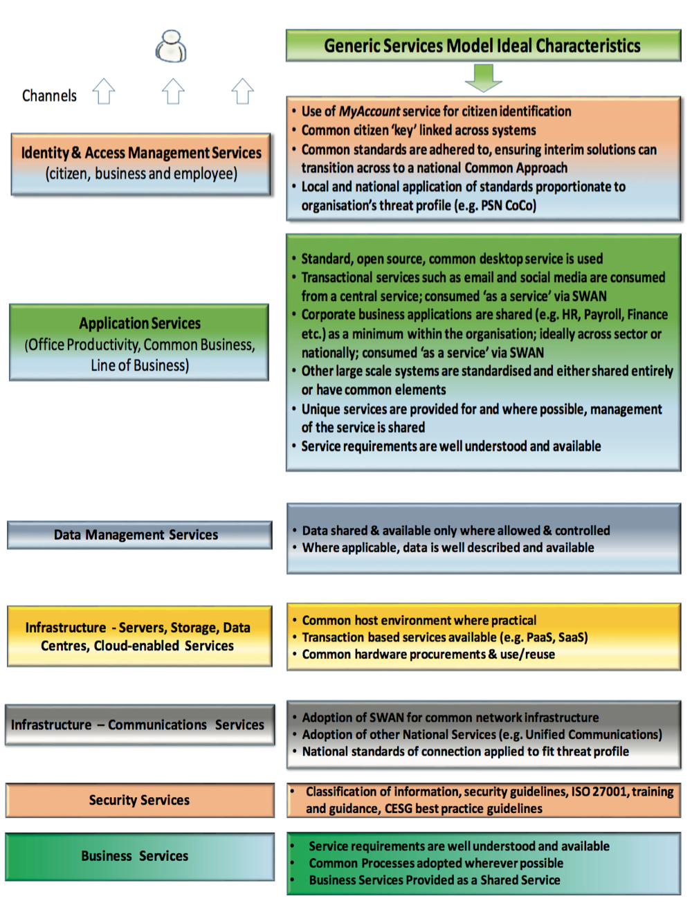

# Reference Model: High Level Operating Framework Generic Services Model

## Purpose

An architecture reference model is an abstract framework or domain-specific ontology consisting of an interlinked set of clearly defined concepts produced by an expert or body of experts in order to encourage clear communication. This frame of reference can then be used to communicate ideas clearly among members of the architecture and/or delivery community.

The purpose of this model is to provide a common vocabulary for strategic ICT planning across the Scottish public sector.

## Contents

<!--TOC max3-->

## Revision History

| Version | Issued     | Comments
| -       | -          | -
|     0.1 | 15-04-2016 | Extracted from the HLOF version 2.

## Distribution List

| Role | RACI
| -    | -
| Head of Digital Architecture (HoDA) | Responsible

N.B. The HoDA is responsible for reviewing this document all other responsibilities related to this reference model are as for the HLOF.

## Review

| -                  | -
| *Review frequency* | 6 months
| *Next review due*  | 15-10-2016

N.B. review of this model is restricted to considering that HLOF, version 2 is till the current version and that, therefore, this model is relevant.

## Role

 The purpose of the model is to provide a common vocabulary for strategic ICT planning across the Scottish public sector. Each of the components outlined in the taxonomy is expanded in the discussion section to describe what these components might look like in an 'Ideal Services Model'.

 This reference model has been extracted from [version 2 of The High Level Operating Framework](http://www.gov.scot/Topics/Economy/digital/digitalservices/HLOF).

## Scope

- [ ] Foundation
- [ ] Common Systems
- [ ] Industry
- [x] Org-specific

This reference model is specific to the Scottish public sector.

## Taxonomy

### Business Services
Business Services are fully integrated into the ICT service delivery model, relying on all aspects of the services. While internal and external customer service is provided through the channels, business processes are supported at all layers of the architecture. This model represents the two-way relationship between ICT and Business architectural strategies.

### Channels
Business processes are integrated into the applications that are supported by ICT and are delivered through the many channels available. Applications and services have a potentially large and diverse client-base both internal and external customers, that may choose or need to employ a variety of access channels e.g. PC/Mac/Linux devices, secure kiosk, thin client, smartphone or other mobile device. Common standards and approaches will support the delivery of services over these channels in as efficient means as possible.

### Identity & Access Management Services
Security needs to be central to how modern business operates. Within the public sector specifically, there is a need to:

- support the concept of "The Citizen" nationally, across sectors and locally;
- share information more readily (e.g. within the health, social services and criminal justice domains);
- enable public or citizen access to an increasingly diverse service base in a uniform and consistent manner.

Common security and ID management processes, services and tools are essential elements to enable all of these aspirations.

### Applications Services

#### Office Productivity Applications Services
Standard office productivity applications like Word, Excel and email are widely prevalent in the user community today. Their interoperability and the incorporation of new 'standard applications', such as emerging social media platforms, are vastly common across the Scottish Public Sector. Where there is a perceived unique requirement in this tier, this should be considered the exception rather than the rule.

#### Common Business Applications Services
In some sectors, organisations can operate similar to independent businesses having their own individual employment processes, payroll, finance, facilities management etc. Therefore there are a number of business services, payroll, HR, etc. which are similar in their application across all organisations and sectors. As noted in the national and draft sectoral strategies, organisations are expected to standardise and re-use across these services rather than buy or build, compromising on business process fit to allow standardisation to take place.

#### Line of Business Applications Services
Line of Business Applications can in some cases by definition, be specific to the agency/public body that requires them. In a number of cases they may be bespoke applications. However, even at this level, there will be opportunities to share data, or perhaps compromise on process to allow for standardisation of applications.

### Data Management Services
The Data Management Services category includes ICT services to enable information sharing and re-use, via the standard description and discovery of common data and the promotion of uniform data management practices. It includes 4 major areas where provides a standard means by which data may be described, categorised and shared.

Within the model there are four standardisation areas:

- **Data Description**: provides a means to describe data uniformly, thereby supporting its discovery and sharing;
- **Data Context**: facilitates discovery of data through an approach to the categorisation of data according to taxonomies;
- **Data Sharing**: supports the access and exchange of data where access consists of ad hoc requests (such as a query of a data asset) and exchange consists of fixed, recurring transactions between parties. It is enabled by capabilities provided by both the Data Context and Data Description standardisation areas;
- **Data Ownership**: Data is owned by the business and accountability for its quality lies with business owners.

### Infrastructure - Servers, Storage, Data Centres, Cloud Enabled Services
The deployment of physical ICT assets has evolved dramatically in recent years. Critical business applications, for example ones which impact the safety of the public or employees, require high availability, which can best be delivered through modern data centres. Public Sector organisations should refer to the guidance in the Scottish Public Sector [Data Hosting and Data Centre Strategy](http://www.gov.scot/Topics/Economy/digital/digitalservices/datahostingdatacentres) and Scottish Public Sector Guidance on [Cloud Computing](http://www.gov.scot/Publications/2015/04/1707), [Virtualisation](http://www.gov.scot/Publications/2015/04/2741) and [Co-location](http://www.gov.scot/Publications/2015/04/4179) when assessing how and where to host their data Infrastructure - Servers, Storage, Data Centres and Cloud Enabled Services.

### Infrastructure – Communications Services
This high level category contains services relating to the provision of data and voice telecommunications.

### Security Services
Security Services are required by all other services and provide the means by which information is secured, made available and integrity is maintained. Security Services is a blend of process and technology to provide assurance that the value of public information is sustained throughout its usable life.

## Graphic

## Discussion

It is recognised that public sector organisations will have different capabilities for each of the service components described above. In addition, they will not all be at the same level of adoption or be able to advance at the same rate.

Using the high level categories from the Generic Services Model, broad characteristics of an ideal state for the service category are described in Figure 3, which organisations could use to evaluate their current capability and map out their short term plans and longer term strategies for adoption and change.

Note that Channels are not included in the above model, as their development and uptake will be drivers for the above service delivery routes evolution, rather than being part of an organisation’s delivery capability.

## References

- [The High Level Operating Framework, version 2](http://www.gov.scot/Topics/Economy/digital/digitalservices/HLOF)
- [TOGAF standard, version 9.1, part VI](http://pubs.opengroup.org/architecture/togaf9-doc/arch/toc-pt6.html);
- [Wikipedia: Reference Models](https://en.wikipedia.org/wiki/Reference_model).
